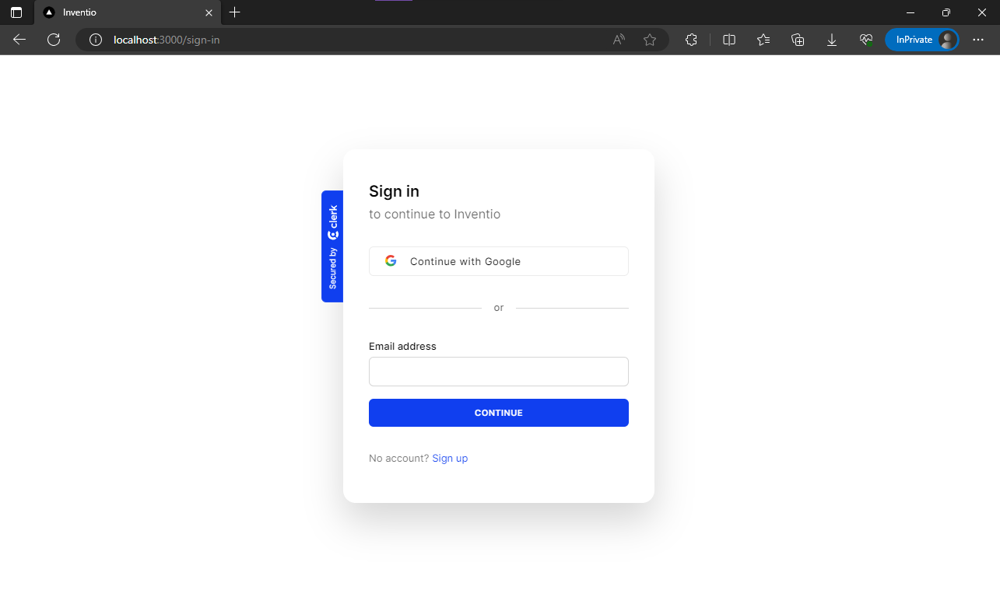
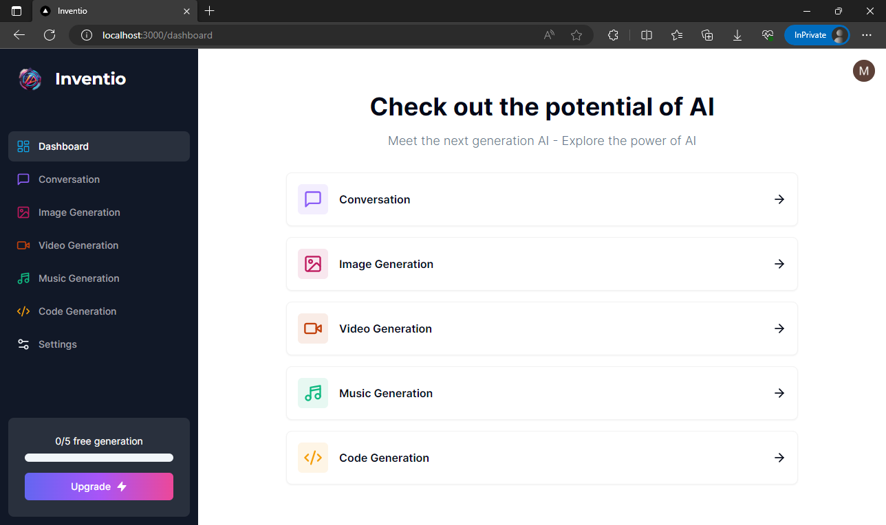
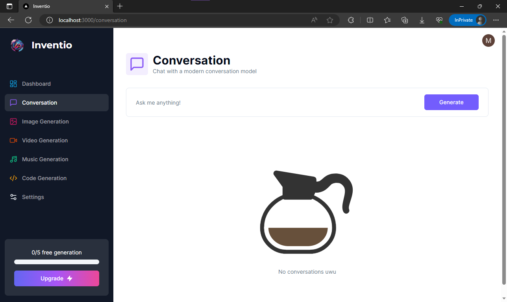
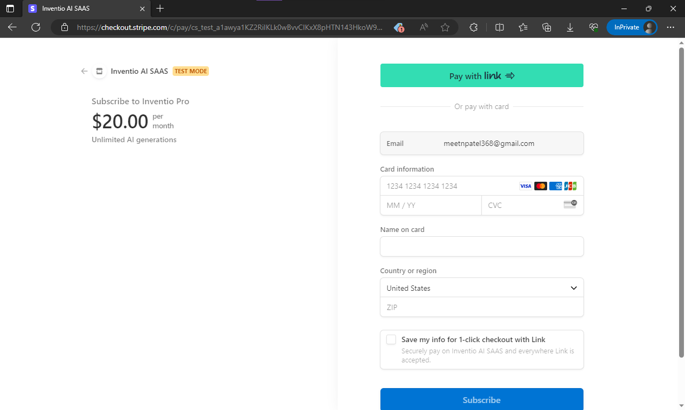

# Inventio: AI SAAS Platform

Welcome to the AI SAAS Platform, your one-stop solution for harnessing the power of AI to bring your ideas to life! The platform empowers users to interact with AI-driven services, enabling a seamless transition from text prompts to rich media outputs. With a focus on versatility and creativity, the platform offers five distinct features to fulfill your creative and practical needs.

## Features

### General Chat with AI
Have a question or need information? Engage in a conversation with our AI and get the answers you're looking for.

### Text-to-Image Generation
Transform your textual ideas into captivating images! Our AI-powered image generation brings your words to life.

### Text-to-Video Generation
Unleash your imagination by converting text prompts into engaging videos. Create visual stories effortlessly.

### Text-to-Audio Generation
Elevate your content with audio! Our AI seamlessly converts text into high-quality audio, perfect for podcasts, presentations, and more.

### Text-to-Code Generation
Need a coding solution? Describe your requirements, and watch as our AI generates functional code snippets for you.

### Payment and Free Trial
I've integrated Stripe API for secure and hassle-free payments. Choose a plan that suits your needs and enjoy unlimited access to our AI SAAS platform. It also provides 5 free trial prompts, allowing the users to experience the power of AI before making a commitment.

Users also have ability cancel their subscription and delete their account from the platform.

## Getting Started
Sign up for an account on our website.
Choose a plan that fits your requirements.
Access our AI-powered features and start creating!

### Installation
To use our platform locally, follow these steps:

- Clone this repository: git clone https://github.com/Meet-forever/Inventio.git
- Navigate to the project directory: cd ai-saas-platform
- Install dependencies: npm install
- Configure your Stripe API keys in config.js.
- Start the server: npm start
- Access the platform at: http://localhost:3000

### Contributing
This is just a demo project to understand how different APIs integerate with each other. Feel free to fork this repository, and make improvements to the project.

## Website Demo

### Landing Page

### Sign-in

### Dashboard

### Feature demo

### Payment Page
